# Mountain Magic Accomodation

This is the static website of Mountain Magic Container Homes available for rent on Airbnb. It is designed to be responsive on all devices and most of all functional so that users can be inticed to book via Airbnb or to contacct the host directly to ask further questions.

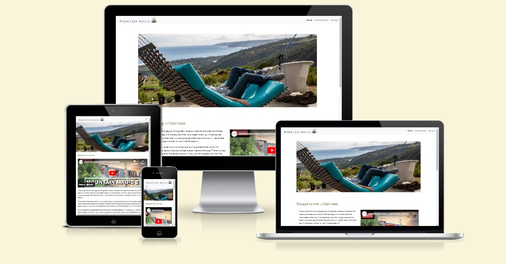

---

## CONTENTS

* [User Experience](#user-experience-ux)
  * [User Stories](#user-stories)

* [Design](#design)
  * [Colour Scheme](#colour-scheme)
  * [Typography](#typography)
  * [Imagery](#imagery)
  * [Wireframes](#wireframes)

* [Features](#features)
  * [General Features on Each Page](#general-features-on-each-page)
  * [Future Implementations](#future-implementations)
  * [Accessibility](#accessibility)

* [Technologies Used](#technologies-used)
  * [Languages Used](#languages-used)
  * [Frameworks, Libraries & Programs Used](#frameworks-libraries--programs-used)

* [Deployment & Local Development](#deployment--local-development)
  * [Deployment](#deployment)
  * [Local Development](#local-development)
    * [How to Fork](#how-to-fork)
    * [How to Clone](#how-to-clone)

* [Testing](#testing)

* [Credits](#credits)
  * [Code Used](#code-used)
  * [Content](#content)
  * [Media](#media)
  * [Acknowledgments](#acknowledgments)

---
## Target Audience

The target audience is all tourists travelling through the western cape of South Africa that may pass through the wilderness area and are looking to stay over at the airbnb. The uniqueness of the accomodation and the amazing views are a big positive in the ease of selling point. The website is fairly basic with a good review from a past guest, beautiful images, a short desription of each of the accomodation options along with a side scrolling gallery, also there is a clearly visible "book now" image link underneath each gallery. Then there is a contact page with a map, contact form and contact details. An airbnb link has been placed on the accomodation page that will take users to book for each of the accomodation options.

## User stories

The content will not change too much so the user experience goals for the first time visitor to returning visitor are essentially the same. These goals are primarily:

### As a tourist I would like to get a feel of the accomodation
Images throughout the site display a good feel of the sorrounding area as well as the accomodation page which shows the two different accomodation options. The review on the first page also gives a good insight on the kind of experiences that a guest has to entice potential guests to book.

### Make booking and communication easy
On the accomodation page there is are clearly visible book now buttons that link the user to airbnb pages to book the accomodation selected, these also have the correct aria labels so that visually impaired users know which accomodation option they are selecting to book. The contact page has more contact details available as well as a contact us form and a map showing directions to the accomodation.

### Make the above equally user friendly on all available devices
By using appropriate media queries to adjust the website to all screen sizes and using flexbox to adapt wider screen content down to smaller sized content better suited to columns instead of row layout. I made a media query with a break point for screen sizes below 1000px and tested this on chrome and it seems the best option for the user experience. 

## Design

### Colour Scheme

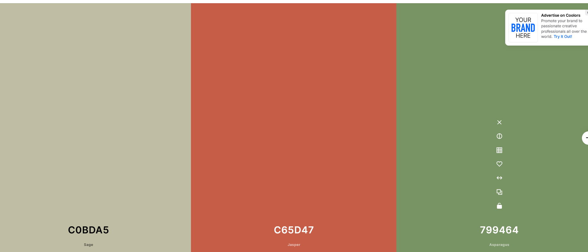 

The choice of my color scheme was inspired by the nature sorounding this airbnb so it was earthy and green, but also using the colors in the logo of the website, namely the green and orange-red of the aloe plant in the logo. 
The headings of the content I used the green color above and and social media icons I used the orange with the color changing to orange with a hover css effect.

### Typography

I went for a google font Lato because it looked clean and modern and was easy to setup. Below is a screenshot of the font.

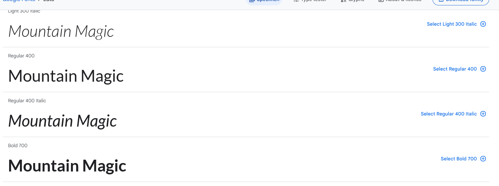 

### Imagery

The imagery chosen was to showcase the beauty of the area and to entice potential clients to want to book the accomodation. 

### Wireframes

### Home
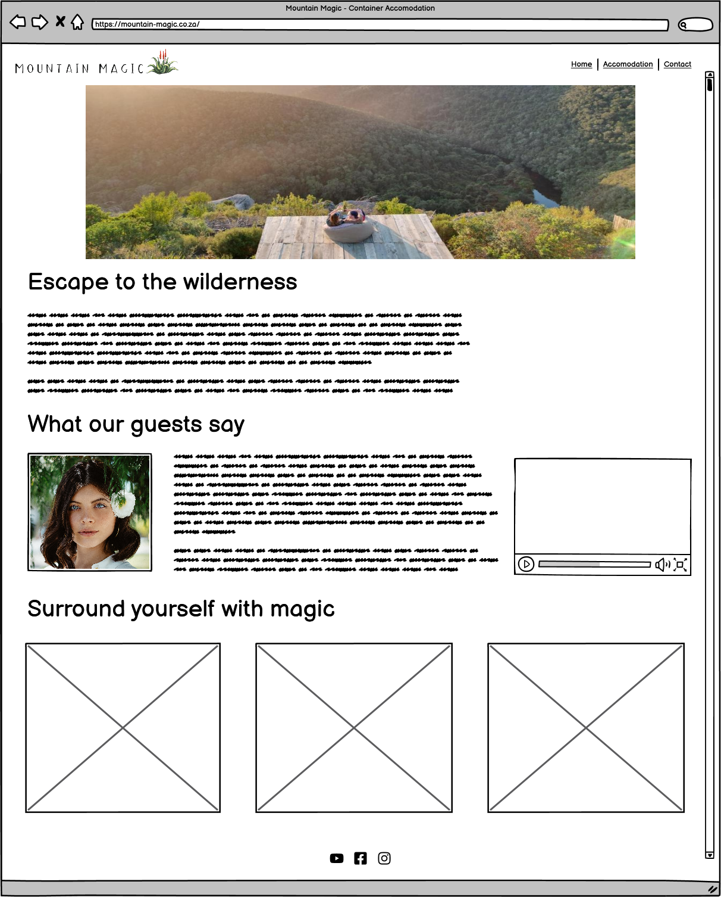 

### Accomodation
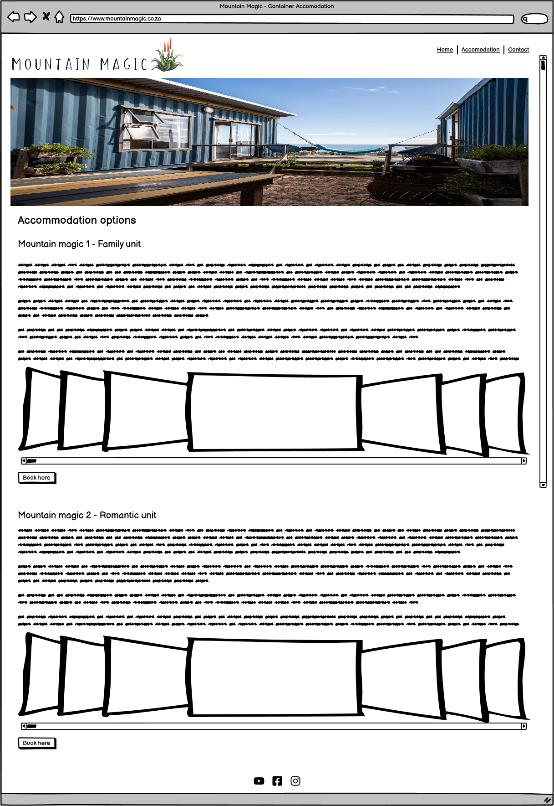 

### Contact
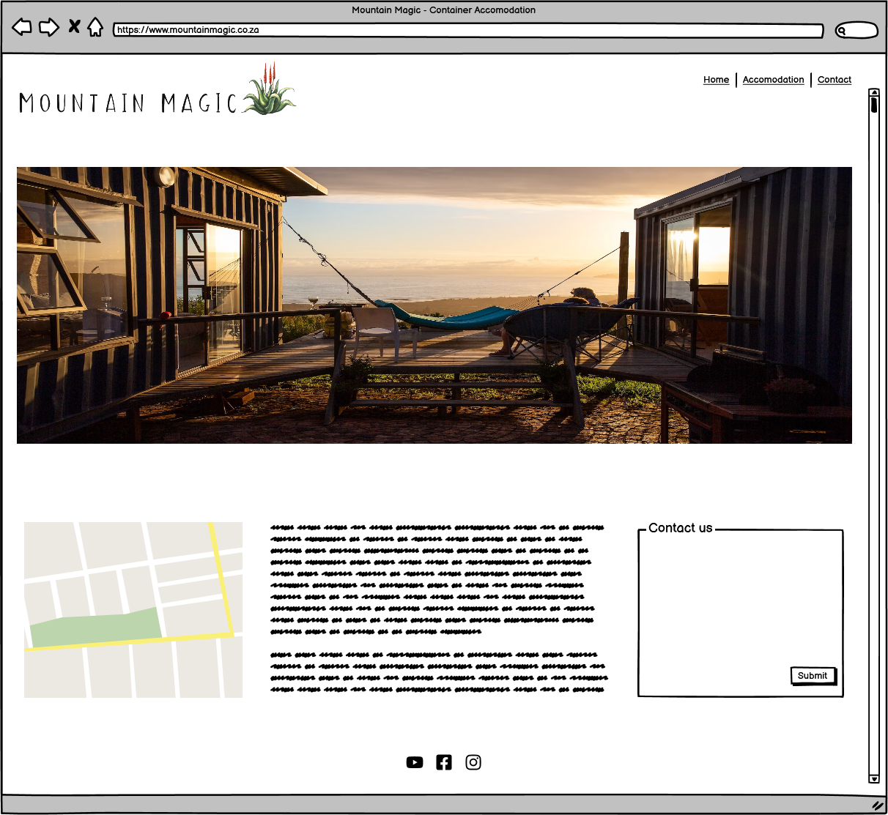 

### Mobile view
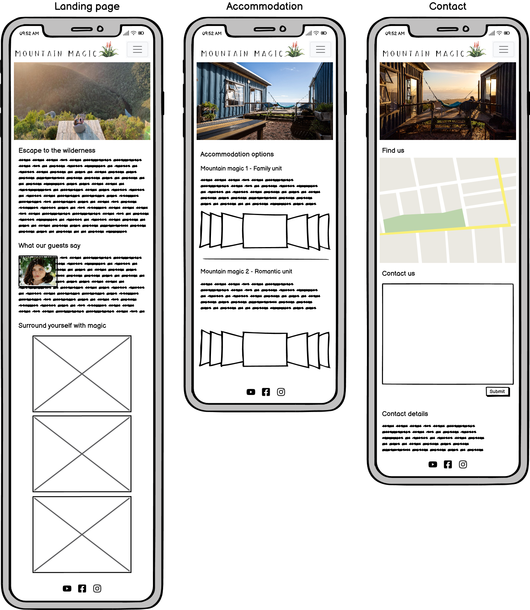 

I used Balsamiq to design my wireframes.

## Features

### General features on each page

### Navbar

I used a navbar from Bootstrap, below are two views of the desktop view and the responsive mobile view that transforms into a hamburger menu. The text is bolder for the naviation text that the user is currently on.

Desktop version nav bar with menu

Mobile version nav bar hamburger menu

### Footer with social media icons

I added three social media icons for instagram, facebook and airbnb. They were sourced from font awesome and I changed the color to the same orange-red color chosen in the color pallette previously mentioned, a hover effect changes it to the green in the color pallete as shown below.

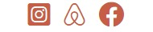
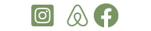

## Features by page

### Landing page

The Landing page has a short intro of text describing the accomodation and how popular it is based on reviews and via publications. Then we have a review from a past customer with a portait image of her and a youtube video to the side displaying the containers and the area. I then chose 3 very colourful images that showcase the beauty of the area directly below the above content. I feel that the landing page is a great showcase for the containers and entices the user to click to the next pages where they will hopefully book or at least make an enquiry which is the end goal of the website.

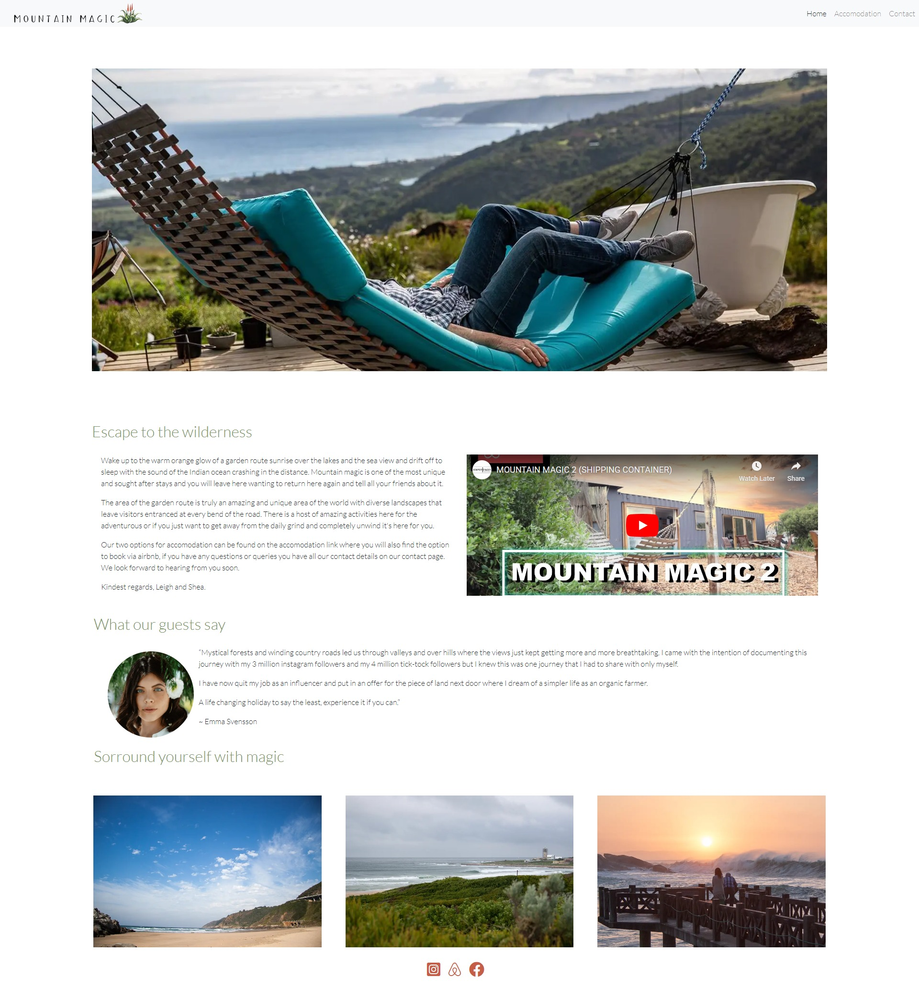

### Accomodation page

The accomodation page features the two options for accomodation with an overview of how many rooms and bathroooms available, a short writeup on the accomodation, a responsive mosaic tile gallery as well as a book here link below which takes the user to airbnb where they can book. 

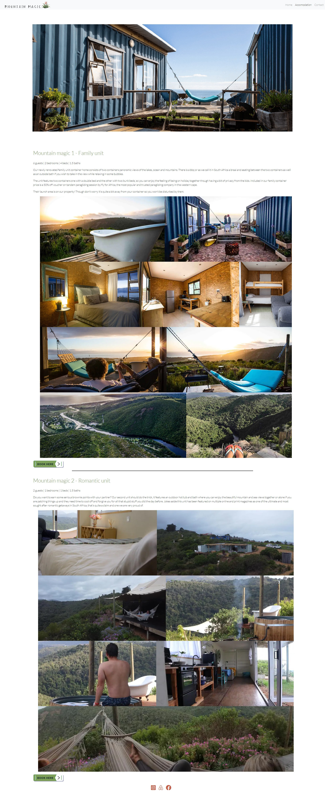

### Contact page

The contact page features a google map that was embedded via google maps and a contact form, the thank you message in the popup box after submitting the form is a simple alert javascript function. The third column in the row is just the basic contact details of the bnb's.

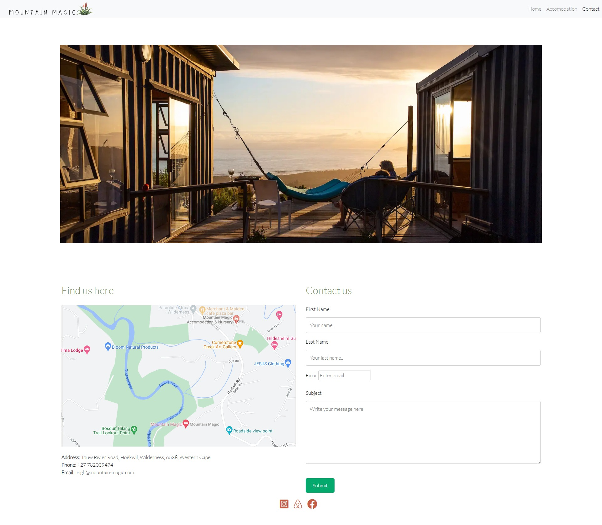

### Future Implementations

I would like that the review on the home page will be scrollable to show more than one review. I would to improve the performance of the website, when I ran lighthouse I could see that a few things were slowing down the site. 

### Accessibility

I have made use of aria-labels for screen readers and did the best I could to use semantic elements so that the page was easy to navigate and understand. I also added labels for all images. 

## Technologies Used

**Github** - Used for storage of my site and for publishing online.\
**Codeanywhere** - The IDE used for editing my site and pushing changes.\
**Python** - Used python 3 via terminal to preview my site using a local http server.\
**HTML5** - The core of the site was built with HTML version 5.\
**CSS** - CSS was used to style the website and define fonts and layout.\
**Bootstrap** - Bootstrap was used to align items and create items such as the Navbar, accordion, carosel, flipcards, forms etc.\
**Google Maps** - Google maps embed from Google inc.\
**Youtube** - Videos embedded from Youtube.\
**Font Awesome** - Social Media icons from Font Awesome.\
**Google Chrome** - The website was built and tested in google Chrome.\
**TinyPNG Website** - Used to compress images so they load faster.\
**Codebeautify Website** - Used to clean up css and html code\
**Favicon Generator Website** - Converted PNG file that I made from the logo using photoshop and converted it into a favicon on website favicon.io\

### Languages Used

HTML, CSS, Javascript

### Frameworks, Libraries & Programs Used

**Bootstrap** - for the responsiveness of the website despite having to add a media query for the 1000px breakpoint so that the site looked better on mobile and tablets. I also used bootstrap code for the navbar.\
**Github** - I used GitHub for the storage of my site and Gitpages to pubish my website.\
**Photoshop** - Used photoshop for some of my image resizing.

## Deployment & Local Development

### Deployment

I deployed everything my website onto gitpages.

### Local Development

#### How to Clone

1. Log into your account on github
2. Go to the repository of this project /adrianskelton/Projecto1/
3. Click on the code button, and copy your preferred clone link.
4. Open the terminal in your code editor and change the current working directory to the location you want to use for the cloned directory.
5. Type 'git clone' into the terminal, paste the link you copied in step 3 and press enter.

#### How to Fork

To fork the repository:

1. Log in (or sign up) to Github.
2. Go to the repository for this project, adrianskelton/Projecto1
3. Click the Fork button in the top right corner.

## Testing
## Manual Testing

### Jigsaw CSS Validator

[Jigsaw](https://jigsaw.w3.org/css-validator/validator) was used to validate the css code
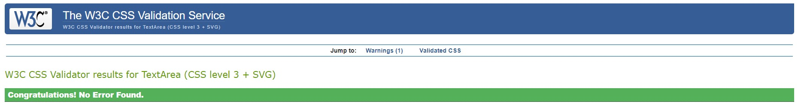 - Pass

### W3C Validator

[W3C](https://validator.w3.org/) was used to validate the HTML on all pages of the website. It was also used to validate the CSS.

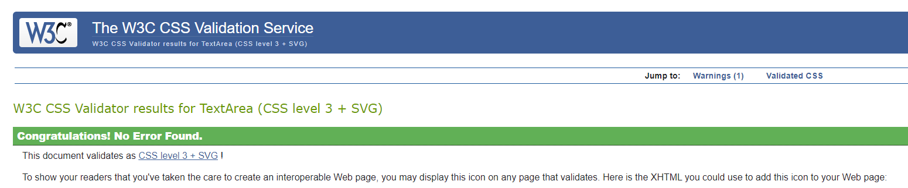 - Pass
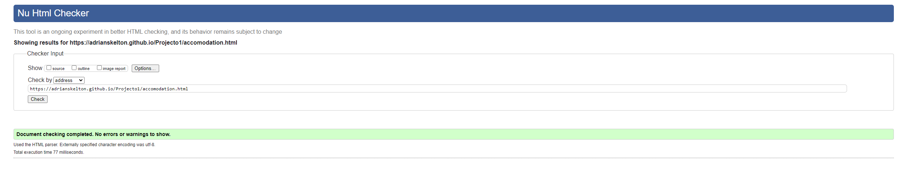 - Pass

### Lighthouse

I used Chrome's Lighthouse developer tool to check my sites performance, it was being slowed down by large images before compression but then faired well after compression. Below are the final results.

### Index page

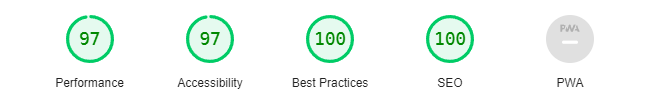

### Accomodation page

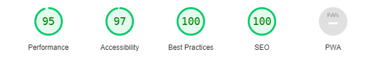

### Contact page

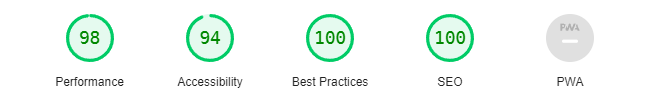

### Full Testing

Full testing was performed on the following devices:

* Laptop:
  * Huawei matebook D
* Mobile Devices:
  * iphone 10
  * Google pixel 5

Each device tested the site using the following browsers:

* Google Chrome
* Safari
* Firefox

Additional testing was taken by friends on a variety of devices and screen sizes. 

| Feature | Expected Outcome | Testing Performed | Result | Pass/Fail |
| --- | --- | --- | --- | --- |
| `Navbar` |
|  |  |  |  |  |
| Mountain Magic Logo & Title | When clicked the user will be redirected to the home page. | Clicked Logo and title | Redirected to the home page. | Pass |
| Home Page Link | When clicked the user will be redirected to the home page.| Clicked link | Redirected to the home page. | Pass |
| Accomodation Link | When clicked the user will be redirected to the accomodation page. | Clicked link | Redirected to the accomodation page. | Pass |
| Contact Link | When clicked the user will be redirected to the Contact page. | Clicked link | Redirected to the contact page | Pass |
| --- | --- | --- | --- | --- |
| `Footer` |
|  |  |  |  |  |
| Social Icons | When clicked the user will be redirected to the appropriate social media pages in a new window. | Clicked icon | Redirected to the social media page in a new window. | Pass |
| --- | --- | --- | --- | --- |
| `Home Page` |
|   |   |   |   |
| Youtube video | Video does not autoplay only when clicked does it play. | Clicked video  | Video plays | Pass |
| --- | --- | --- | --- | --- |
| `Accomodation Page` |
|   |   |   |   |
| Book here buttons | When clicked will open the airbnb site in a new window for the appropriate accomodation | Clicked on the buttons | Opened a new airbnb window for the appropriate accomodation | Pass |
| Gallery responsiveness | When window resized gallery was responsive and site layout looked as expected | Resized window | Gallery was responsive and looks good | Pass |
| --- | --- | --- | --- | --- |
| `Contact Page` |
|   |   |   |   |
| Google Map | Map should be interactive when clicked on | Clicked on map | Map zoomed in and reacted as expected | Pass |
| Contact form | When items were left out the was a message asking to fill the section in| Clicked submit while leaving form unfillled | Form requested sections to be filled in | Pass |

 - - -

## Credits

### Code Used

The navbar I used was from bootstrap.  (https://getbootstrap.com/docs/4.0/components/navbar/)

To make the youtube video responsive I found this css code clip (https://yoast.com/how-to-make-youtube-videos-responsive/)

Contact form with validation (https://www.w3schools.com/howto/howto_css_contact_form.asp) modified to suit my site

Photogallery used on accomodation page (https://codepen.io/maxvoltar/pen/eYOPdMG)

Tip used to not target all ul and li tags but only the above photogallery (https://stackoverflow.com/questions/49995250/css-global-change-to-all-ul-li-except-specific-id-or-class)

### Content

I wrote all of the content for the website, though I did get some information from mountain magic's website such as how many rooms and bathrooms of each container unit.

###  Media

As my brother owns the container homes this was another reason to use this as my project as it made aquiring the images and video content easy without having to ask for permission from somebody I did not know. 

Images that were not from my brother was the portrait image for the reviewer on the home page which I got from royalty free website pexels.com (https://www.pexels.com/photo/woman-wearing-white-shirt-with-white-flower-on-her-ear-3586798/)
The other 3 images above the footer on the home page are my own.

  
###  Acknowledgments

I would like to thank my mentor Narender as well as all the users on slack for all their opinions and code reviews. 