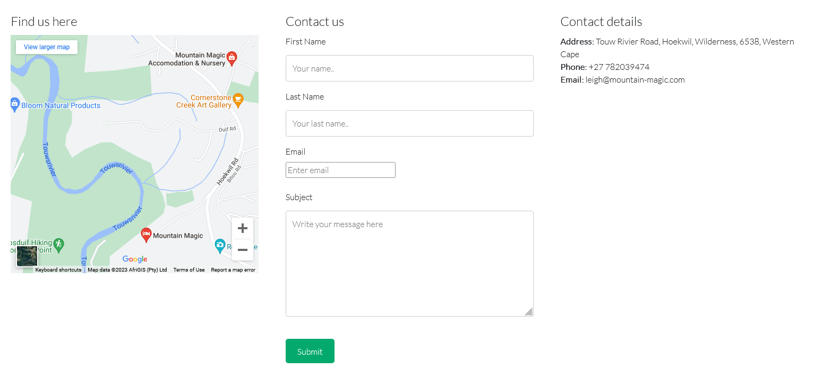

# Mountain Magic Accomodation

This is the static website of Mountain Magic Container Homes available for rent on Airbnb. It is designed to be responsive on all devices and most of all functional so that users can be inticed to book via Airbnb or to contacct the host directly to ask further questions.

---

## CONTENTS

* [User Experience](#user-experience-ux)
  * [User Stories](#user-stories)

* [Design](#design)
  * [Colour Scheme](#colour-scheme)
  * [Typography](#typography)
  * [Imagery](#imagery)
  * [Wireframes](#wireframes)

* [Features](#features)
  * [General Features on Each Page](#general-features-on-each-page)
  * [Future Implementations](#future-implementations)
  * [Accessibility](#accessibility)

* [Technologies Used](#technologies-used)
  * [Languages Used](#languages-used)
  * [Frameworks, Libraries & Programs Used](#frameworks-libraries--programs-used)

* [Deployment & Local Development](#deployment--local-development)
  * [Deployment](#deployment)
  * [Local Development](#local-development)
    * [How to Fork](#how-to-fork)
    * [How to Clone](#how-to-clone)

* [Testing](#testing)

* [Credits](#credits)
  * [Code Used](#code-used)
  * [Content](#content)
  * [Media](#media)
  * [Acknowledgments](#acknowledgments)

---

## User stories

The content will not change too much so the user experience goals for the first time visitor to returning visitor are essentially the same. These goals are primarily:

### Entice the user to want to book
All your files and folders are presented as a tree in the file explorer. You can switch from one to another by clicking a file in the tree.

### Make booking and communication easy
You can rename the current file by clicking the file name in the navigation bar or by clicking the **Rename** button in the file explorer.

### Make the above equally user friendly on all available devices
By using appropriate media queries to adjust the website to all screen sizes and using flexbox to adapt wider screeen content down to smaller sized content better suited to columns instead of row layout.

## Design

### Colour Scheme

</a>

The choice of my color scheme was inspired by the nature sorounding this airbnb so it was earthy and green, but also using the colors in the logo of the website, namely the green and orangy red of the aloe plant in the logo. 

### Typography

I went for a google font Lato because it looked clean and modern and was easy to setup. Below is a screenshot of the font.

</a>

### Imagery

The imagery chosen was to showcase the beauty of the area and to entice potential clients to want to book the accomodation. The images were compressed using website TinyPNG.com to maximise performance.

### Wireframes

### Home
 

### Accomodation
 

### Contact
 

### Mobile view
 

I used Balsamiq to design my wireframes.

## Features

### General features on each page

### Navbar

I used a navbar from Bootstrap, below are two views of the desktop view and the responsive mobile view that transforms into a hamburger menu.

 
Desktop version nav bar
   
 
Mobile version nav bar

### Footer with social media icons

I added three social media icons for instagram, facebook and airbnb. They were sourced from font awesome and I changed the color to the same green color chosen in the color pallette previously mentioned.
  
</a>

## Features by page

### Landing page

The Landing page has a short intro of text describing the accomodation and how popular it is based on reviews and via publications. Then we have a review from a past customer with a portait image of her and a youtube video to the side displaying the containers and the area. I then chose 3 very colourful images that showcase the beauty of the area directly below the above content. I feel that the landing page is a great showcase for the containers and entices the user to click to the next pages where they will hopefully book or at least make an enquiry which is the end goal of the website.

 

### Accomodation page

The accomodation page features the two options for accomodation with an overview of how many rooms and bathroooms available, a short writeup on the accomodation, a horizontal scrollable gallery as well as a book here link below which takes the user to airbnb where they can book. 

</a>

### Contact page

The contact page features a google map that was embedded via google maps and a contact form, the thank you message in the popup box after submitting the form is a simple alert javascript function. The third column in the row is just the basic contact details of the bnb's.

</a>

I then like to add a screenshot of each page of the site here, i use [amiresponsive](https://ui.dev/amiresponsive) which allows me to grab an image of the site as it would be displayed on mobile, tablet and desktop, this helps to show the responsiveness of the site.

### Future Implementations

I would like to more review which would be changed everytime the landing page is visited.

### Accessibility

Be an amazing developer and get used to thinking about accessibility in all of your projects!

This is the place to make a note of anything you have done with accessibility in mind. Some examples include:

Have you used icons and added aria-labels to enable screen readers to understand these?
Have you ensured your site meets the minimum contrast requirements?
Have you chosen fonts that are dyslexia/accessible friendly?

Code Institute have an amazing channel for all things accessibility (a11y-accessibility) I would highly recommend joining this channel as it contains a wealth of information about accessibility and what we can do as developers to be more inclusive.

## Technologies Used

**Github** - Used for storage of my site and for publishing online. 
**Codeanywhere** - The IDE used for editing my site and pushing changes. 
**Python** - Used python 3 via terminal to preview my site using a local http server. 
**HTML5** - The core of the site was built with HTML version 5. 
**CSS** - CSS was used to style the website and define fonts and layout. 
**Bootstrap** - Bootsrap was used to align items and create items such as the Navbar, accordion, carosel, flipcards, forms etc. 
**Google Maps** - Google maps embed from Google inc. 
**Youtube** - Videos embedded from Youtube. 
**Font Awesome** - Social Media icons from Font Awesome. 
**Google Chrome** - The website was built and tested in google Chrome. 
**TinyPNG Website** - Used to compress images so they load faster. 
**Codebeautify Website** - Used to clean up css and html code 
**Favicon Generator Website** - Converted PNG file that I made from the logo using photoshop and converted it into a favicon on website favicon.io 
**Imagebb** - Website used to host images for readme

### Languages Used

HTML, CSS, Javascript

### Frameworks, Libraries & Programs Used

**Bootstrap** - for the responsiveness of the website despite having to add a media query for the 1000px breakpoint so that the site looked better on mobile and tablets. I also used bootstrap code for the navbar.   
**Github** - I used GitHub for the storage of my site and Gitpages to pubish my website
Make sure to include things like git, GitHub, the program used to make your wireframes, any programs used to compress your images, did you use a CSS framework like Bootstrap? If so add it here (add the version used). 
**Photoshop** - Used photoshop for some of my image resizing.

## Deployment & Local Development

👩🏻‍💻 View an example of a completed Deployment & Local Development section [here](https://github.com/kera-cudmore/TheQuizArms#Deployment)

### Deployment

I deployed everything my website onto gitpages.

### Local Development

To clone the repository:

1. Log into your account on github
2. Go to the repository of this project /adrianskelton/Projecto1/
3. Click on the code button, and copy your preferred clone link.
4. Open the terminal in your code editor and change the current working directory to the location you want to use for the cloned directory.
5. Type 'git clone' into the terminal, paste the link you copied in step 3 and press enter.

#### How to Fork

To fork the repository:

1. Log in (or sign up) to Github.
2. Go to the repository for this project, adrianskelton/Projecto1
3. Click the Fork button in the top right corner.

#### How to Clone

To clone the repository:

1. Log in (or sign up) to GitHub.
2. Go to the repository for this project, kera-cudmore/TheQuizArms
3. Click on the code button, select from the options to clone with HTTPS, SSH or GitHub CLI and copy the link shown thereafter.
4. Open the terminal in your code editor and change the current working directory to the location you want to use for the cloned directory.
5. Type 'git clone' into the terminal and then paste the link you copied in step 3. Press enter.

## Testing

## AUTOMATED TESTING

### W3C Validator

[W3C](https://validator.w3.org/) was used to validate the HTML on all pages of the website. It was also used to validate the CSS.

* [Index Page W3C HTML Validation](https://validator.w3.org/nu/?doc=https%3A%2F%2Ffoundintranslationsodaci.herokuapp.com%2F) - Pass

### Lighthouse

I used Chrome's Lighthouse developer tool to check my sites performance, it was being slowed down by large images before compression but then faired well after compression. Below are the final results.

### Index

 

### Accomodation
 

### Contact
 

### Accessibility tester

I used this to check how my site was rated for its accessibility, this led me to add more aria-labels as well as changing alt descriptions for the book here links as I realised having two buttons that both said "book here" could be more confusing that two seperate descriptions that included which container you were booking.
  
Use this part of the README to link to your TESTING.md file - you can view the example TESTING.md file [here](milestone1-testing.md)

## Credits

👩🏻‍💻 View an example of a completed Credits section [here](https://github.com/kera-cudmore/BookWorm#Credits)

The Credits section is where you can credit all the people and sources you used throughout your project.

### Code Used

The navbar I used was from bootstrap.  (https://getbootstrap.com/docs/4.0/components/navbar/)
To make the youtube video responsive I found this css code clip (https://yoast.com/how-to-make-youtube-videos-responsive/)

### Content

I wrote all of the content for the website, though I did get some information from mountain magic's website such as how many rooms and bathrooms of each container unit.

###  Media

As my brother owns the container homes this was another reason to use this as my project as it made aquiring the images and video content easy without having to ask for permission from somebody I did not know. Images that were not from my brother was the portrait image for the reviewer on the home page which I get from royalty free website pexels.com
The other 3 images above the footer on the home page are my own.
  
###  Acknowledgments

I would like to thank Kenan Wright from code institute who helped me along the way as well as my mentor Narender as well as all the users on slack